# QuizApp
* [Deployed Site](https://segh.github.io/QuizApp/)
* [My GitHub](https://github.com/SEGH)

## Description
This is an application with the purpose of running a timed multiple choice quiz that tracks the final results of the users. It runs in the browser with a responsive user interface that adapts to most screen sizes. It is structured with an array of objects that hold questions, answer options, and the correct answer. Currently it holds fifteen questions related to JavaScript, but question objects can easily be added, edited, or removed to customize the quiz.

## Usage
* When the Start Quiz button is pressed the quiz page appears, the timer begins, and the user is presented with the first question.

* As the user selects any answer, they are presented with a new question.

* If they select the wrong answer, 10 seconds is subtracted from the timer.

* The quiz is over once the user has gone through all of the questions, or the timer reaches 0.

* The score is equal to the value of the timer when the questions were completed.

* The user has the option to save their score with their initials to local storage, or they can play again.

* If they select the Save Score, they are automatically taken to the high scores page.

### Examples of responsive interface

### 375px

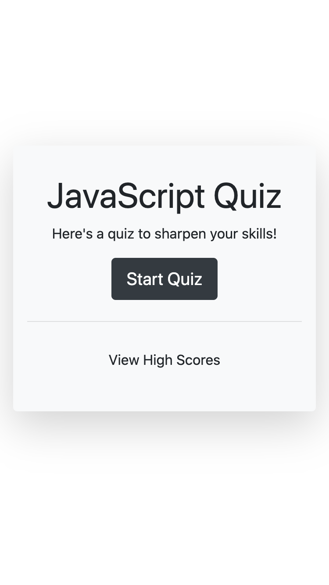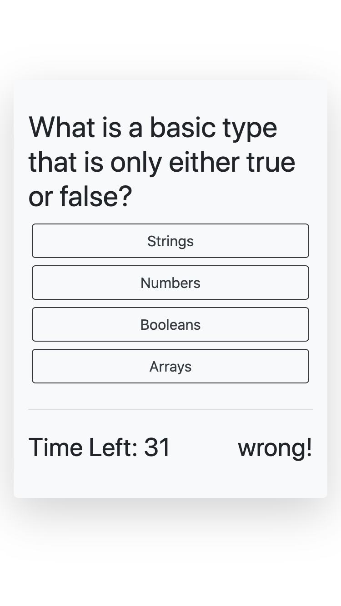
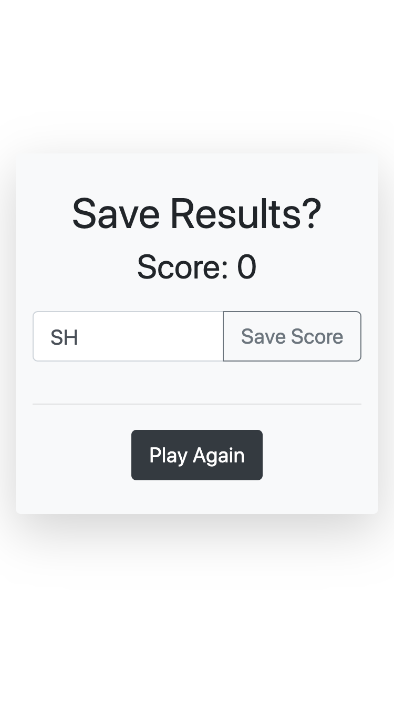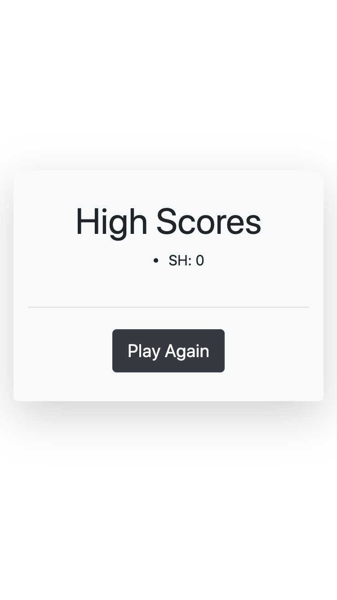
------

### 768px

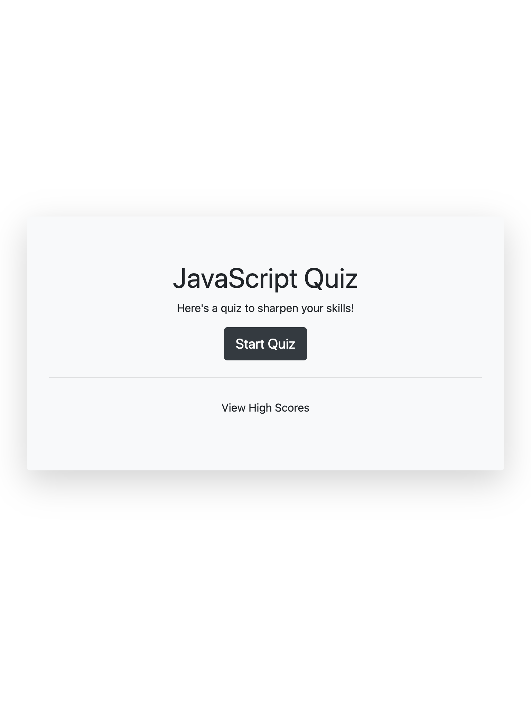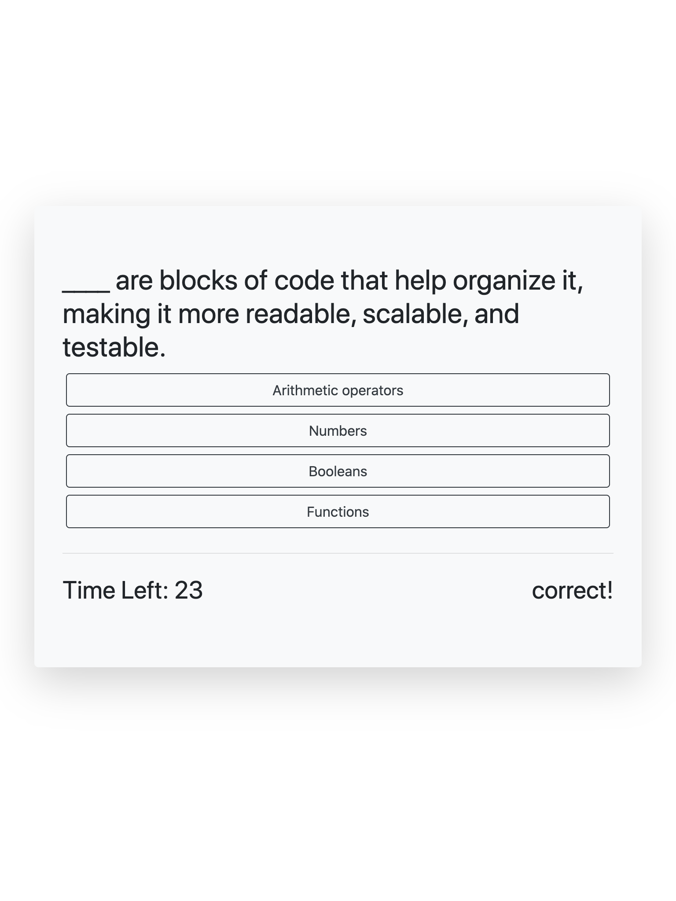
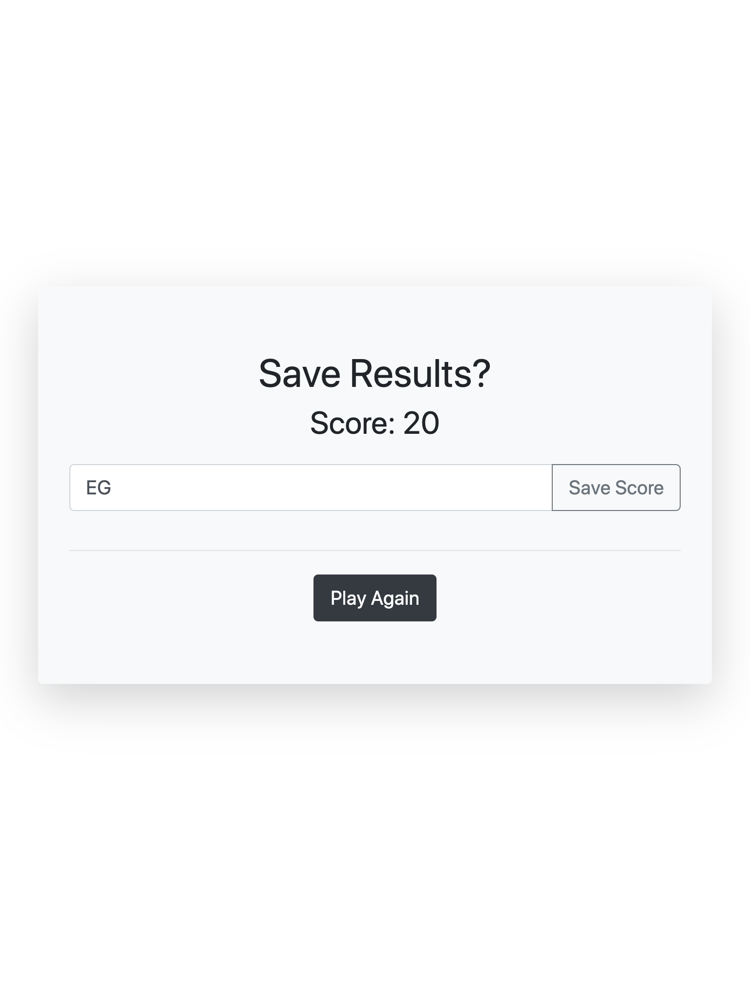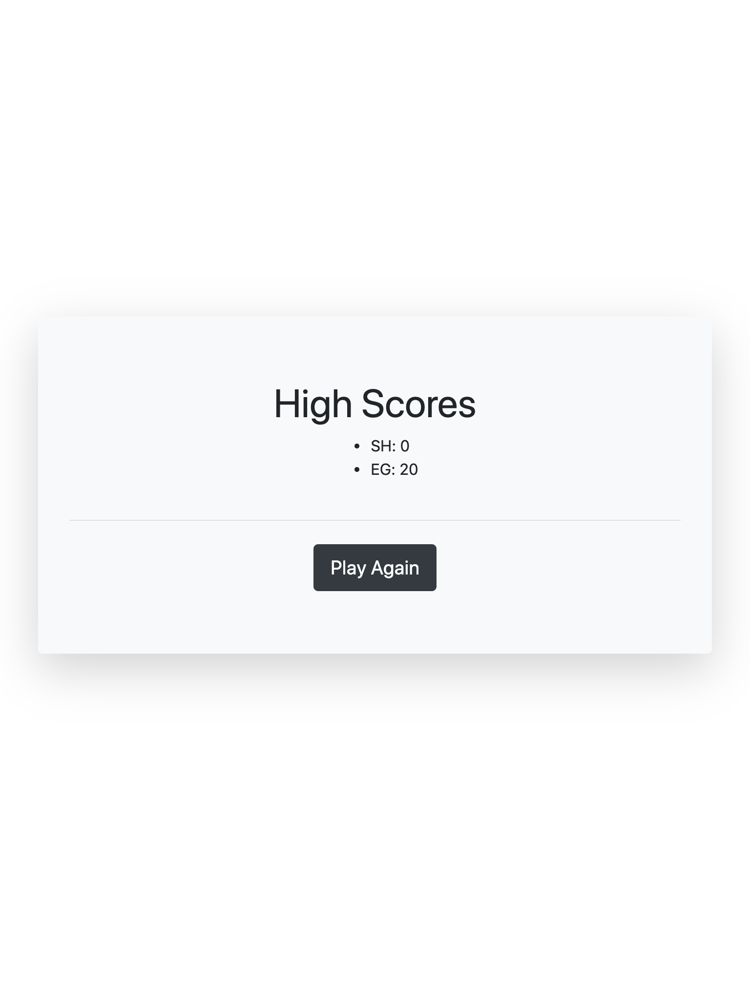
------

### 980px

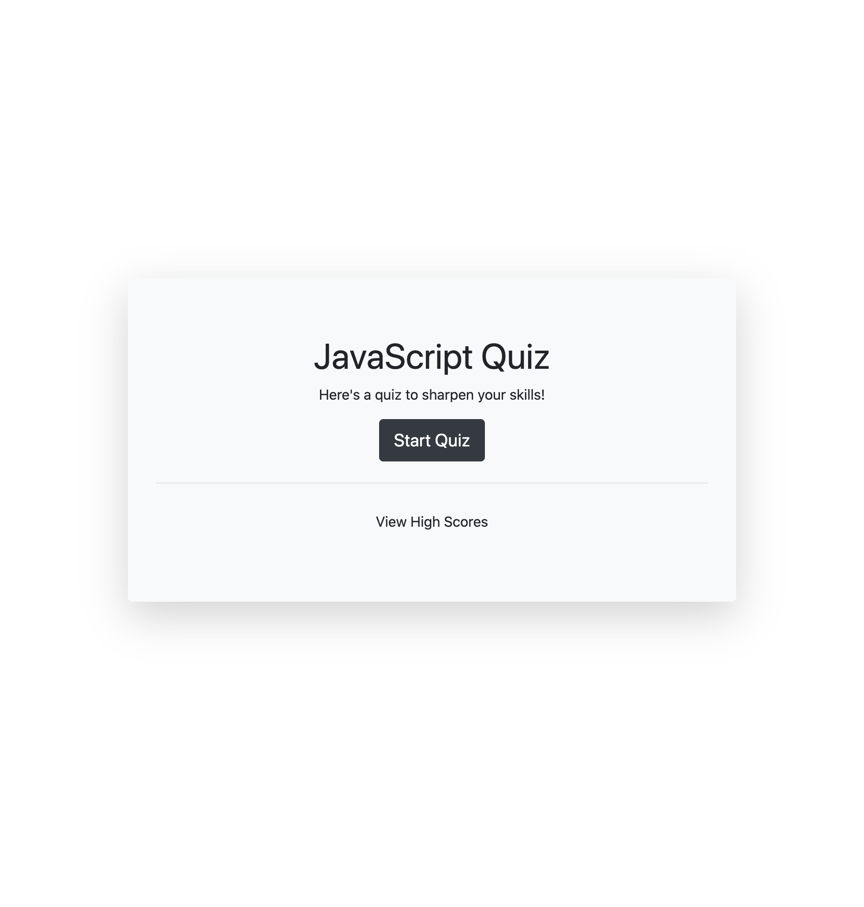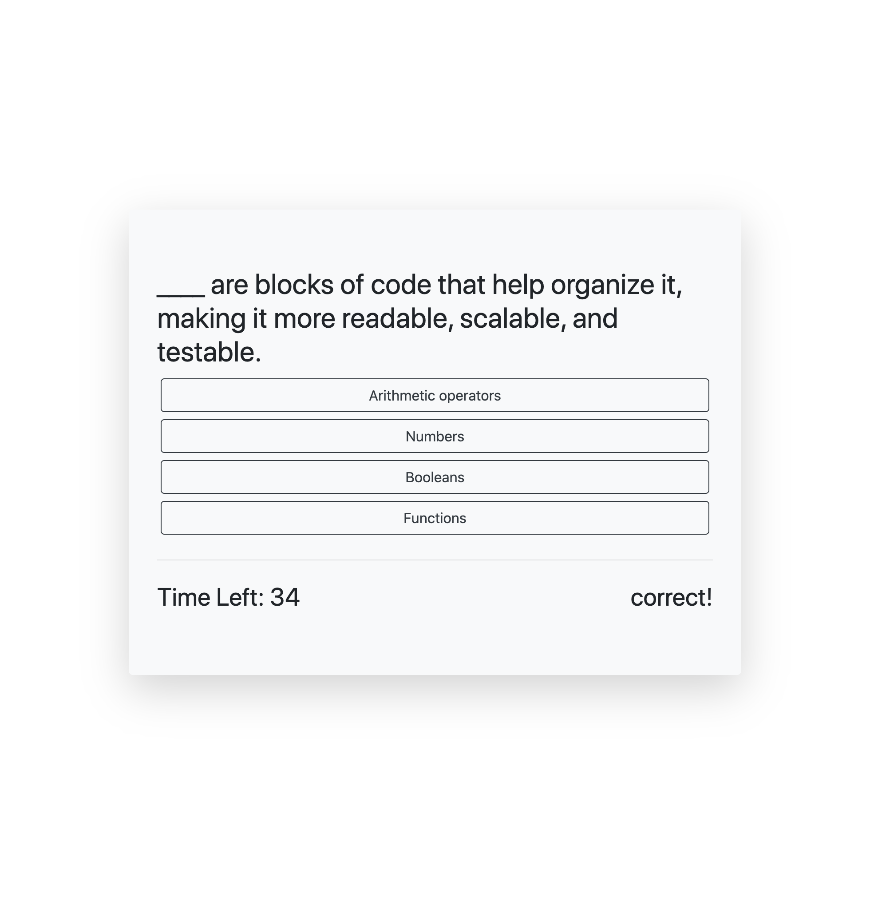
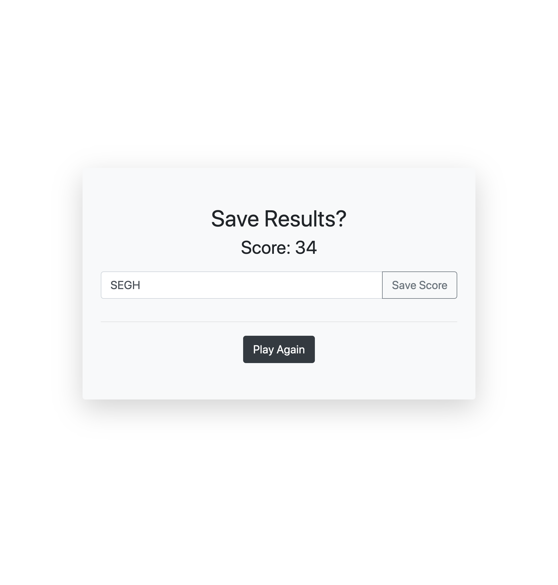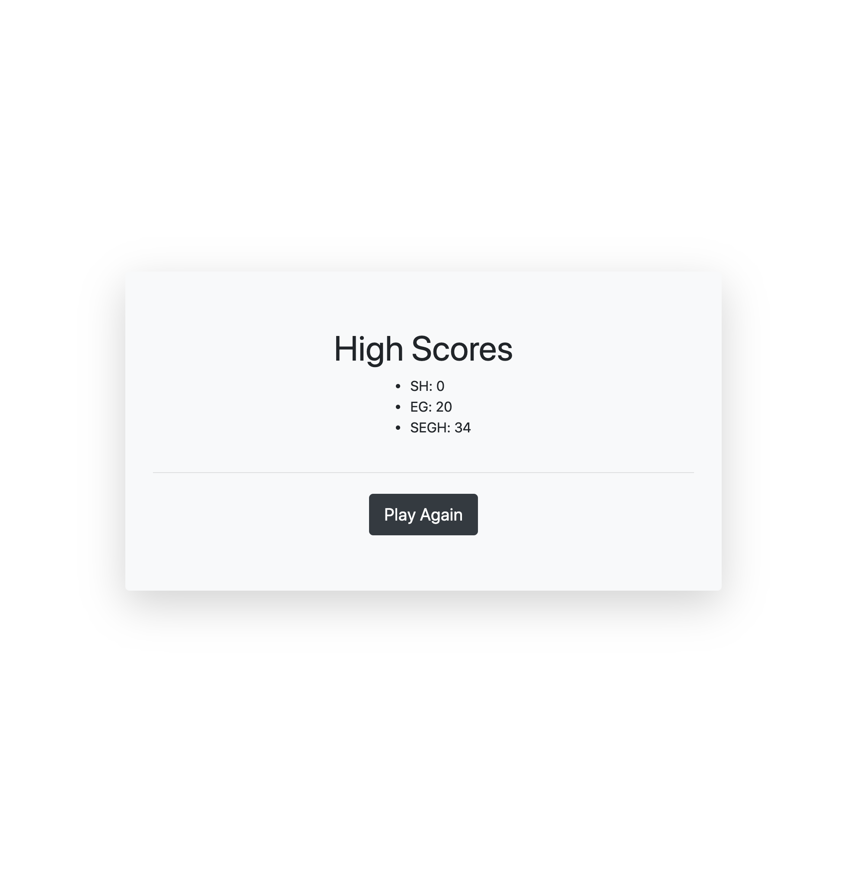
------